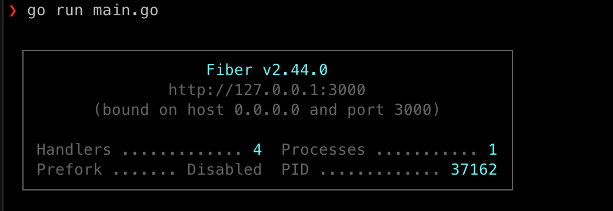
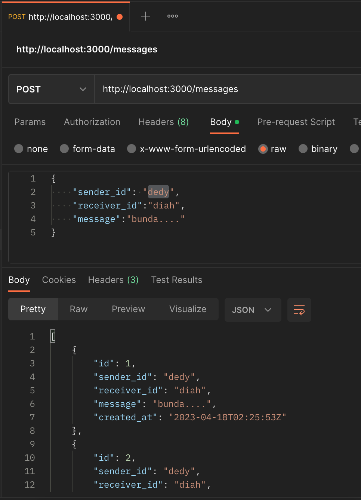

<!-- PROJECT LOGO -->
<br />
<p align="center">
  <h2 align="center">Chat Server - Backend</h2> <br />
</p>


<!-- TABLE OF CONTENTS -->
<details open="open">
  <summary>Table of Contents</summary>
  <ol>
    <li>
      <a href="#about-the-project">About The Project</a>
      <ul>
        <li><a href="#built-with">Built With</a></li>
      </ul>
    </li>
    <li>
      <a href="#getting-started">Getting Started</a>
      <ul>
        <li><a href="#prerequisites">Prerequisites</a></li>
        <li><a href="#installation">Installation</a></li>
      </ul>
    </li>
    <li><a href="#project-structure">Project structure</a></li>
  </ol>
</details>


<!-- ABOUT THE PROJECT -->
## About The Project

This system is using for Amartha - Shorty Challenge.


<!-- BUILD WITH -->
#### Built With

* [Golang](https://golang.org)
* [SQLite](https://sqlite.org/index.html)
* [Fiber](https://docs.gofiber.io/)

<!-- GETTING STARTED -->
## Getting Started

This is an example of how you may give instructions on setting up your project locally.
To get a local copy up and running follow these simple example steps.


<!-- PREREQUISITES -->
#### Prerequisites

* I use macOS Catalina 10.15.7
  ```sh
  ❯ uname -a
  Darwin 192.168.1.25 19.6.0 Darwin Kernel Version 19.6.0:
   ```
* And then you need to install [Golang](https://golang.org/doc/install) prefer using homebrew

* After that check the installation and Golang version it must be above than 1.11 because we need the [Golang Modules](https://blog.golang.org/using-go-modules)
  ```sh
  > go version
  go version go1.20.3 darwin/amd64
   ```


<!-- INSTALLATION -->
## Installation

#### Database
1. Install SQLite with Homebrew
   ```sh
   brew install sqlite
   ```
2. Create the database
   ```sh
   sqlite3 chat.db 
   ```
3. Create table
   ```sh
   CREATE TABLE messages (
    id INTEGER PRIMARY KEY AUTOINCREMENT,
    sender_id INTEGER NOT NULL,
    receiver_id INTEGER NOT NULL,
    message TEXT NOT NULL,
    created_at DATETIME NOT NULL DEFAULT CURRENT_TIMESTAMP
  );
   ```


#### Manual Installation
1. Clone the repo
   ```sh
   git clone https://github.com/jadahbakar/chat-server.git
   ```
2. Install Modules packages
   ```sh
   go mod tidy
   ```
   or
   ```sh
   go mod download
   ```
   
3. Run it 
   ```sh
   go run main.go
   ```   

## Testing
1. After running, It will show on console:

    

2. Testing it on postman:

    Post :

    

6. Stop 
   ```sh
   CTRL + C
   ```


<!-- Project structure -->
## Project Structure

```sh
.
├── README.md
├── assets
│   └── images
│       ├── console.png
│       └── postman.png
├── chat.db
├── go.mod
├── go.sum
└── main.go

3 directories, 7 files
```

